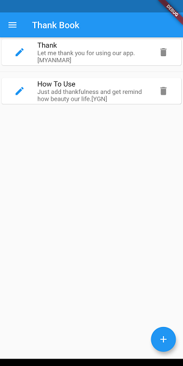

# Thank Book
ဒါကတော့ Thank Book ကို Flutter နဲ့ ပြန်ရေးထားတာပါ။
Flutter လည်း ဖတ်ရင်း၊ App လည်း လူလူသူသူဖြစ်အောင်လုပ်ရင်းပေါ့ဗျာ။ 
See you on App Store :D
 

#### Day-1 2020-11-05
ဘာတွေ ပြီးလဲ?
- Named Route ရပြီ
- Data Model : ThankNote
- MainListView 
- Fab->onPressed() to Thank New Form
- New Form -> Form Validation and Form Data using state

#### Day-2 2020-11-06
- Data Insert
- Data Select
- Get last inserted id , insert method မှာကို ထောက်ပံ့ပေးထားတယ်။ int တစ်ခု return ပြန်ပေးတယ်။ ကိုယ်က primary key column အတွက်သာ ဘာမှ ထည့်မပေးလိုက်နဲ့။ သူက null လို့ မှတ်ပြီး ROWID လို့ မှတ်ထားတဲ့ ဂဏန်းကို ထည့်ပေးမယ်လို့ sqlite မှာ ရှင်းပြထားတာတွေ့တယ်။
- Data Passing between Route အရင်တစ်ခါလည်း ဖတ်ထားတယ်။ သတိမရဘူး။ Widget  Component Lifecycle မှာ တစ်ခုခု လုပ်လို့ရမယ် ထင်နေတာ။ ပြန်ဖတ်နေရင်းမှ အရင်က ဟာကို တွေ့တယ်။ ```Navigator.pop(context,data)``` ဆိုပြီး pass လုပ်ပေးလိုက်လို့ရတယ်။ ဟိုဘက်ကတော့ Future တစ်ခုကို စောင့်ပေးတဲ့ အနေနဲ့ ```final result = await Navigator.pushNamed(context,route);``` ဆိုပြီး await နဲ့ ရေးထားပေးရမယ်။
- Data Update / Delete : Update ဆိုပေမယ့် insert လုပ်တုန်းက conflict တွေဖြစ်လာရင် replace လုပ်ဆိုပြီး ပြောခဲ့တော့ id တူနေရင် replace လုပ်ပြီး Update ဖြစ်သွားရော :D 
- Route Data Passing ကို လည်း တော်တော်လေး သုံးရတယ်။

#### Day-3 2020-11-09
- Date Time Picker ထည့်မယ်၊ field တစ်ခု ထပ်တိုးမယ်
- Notification ပြမယ်။
 
database operation တွေက တစ်ကြောင်းထိုး သွားနေကြတာ။ အဲ့တာကို Future ပြန်ပေးတဲ့အချိန်၊ try{}catch(exp){} နဲ့ ပြန်ပြင်‌ရေးရမယ်။ အခုလိုမျိုး database structure update မဖြစ်သေးချိန်လိုမျိုး error တက်တာကို debug လုပ်မနေပဲ ui မှာတင် သိနိုင်တာမျိုး လုပ်ရမယ်။ ဘာလို့လဲဆို UI Flow လည်း ရပ်သွားတာပဲ မို့လား။ ဘာလို့ရပ်မှန်း အကျိုးသင့် အကြောင်းသင့် ပြသင့်တယ်။

- Database Migration
 
onCreate, onUpgrade, onDowngrade တွေနဲ့ migration script တွေ ရေးထားရမယ်။ drop table တို့ create table တို့ တွေ။

- Setting Page

ဒါလည်း လိုတယ်။ ဒီ app ရဲ့ feature တွေ အကုန်လုံးကို သုံးမယ် မသုံးဘူး၊ ဘယ်လိုပုံစံ သုံးချင်တယ် ဆိုတာမျိုးကို ဒီမှာ ပြင်လို့ရမယ်။ အခု ဉပမာမှာ ဆိုရင် နေ့စဉ် notification တက်ရမလား မတက်ရဘူးလားတွေ မှတ်ထားရမယ်။ ဒီလောက်ကိုတော့ Shared Preference ထဲမှာပဲ အလွယ်မှတ်တာ ကောင်းလိမ့်မယ်။
> shared_preferences: ^0.5.12+4
 
သုံးတော့ သုံးဖူးတယ်၊ မမှတ်မိ။ ဒီတော့ copy cat ပဲ ပြန်လုပ်ကြတာပေါ့။
```dart
_incrementCounter() async {
  SharedPreferences prefs = await SharedPreferences.getInstance();
  int counter = (prefs.getInt('counter') ?? 0) + 1;
  print('Pressed $counter times.');
  await prefs.setInt('counter', counter);
}
```
တကယ်လို့ initial value တွေနဲ့ initialize လုပ်မယ်ဆိုရင်လဲ ရတယ်။ 
```
SharedPreferences.setMockInitialValues (Map<String, dynamic> values);
```
initial value သတ်မှတ်ထားတာကတော့ အကောင်းဆုံးပဲ ဖြစ်မယ်။ ဒီကောင်ကို နေရာတော်တော်များများမှာ ယူသုံးကြမှာဆိုတော့ကာ။
ဒါက TEST CASE အတွက်ပဲလားမသိ။
```
'package:flutter/src/material/checkbox.dart': Failed assertion: line 76 pos 15: 'tristate || value != null': is not true.
```
ဒီ error က check box ရဲ့ value ကို null ပေးလို့ တက်တာ။ ဒီတော့ initState ကို async နဲ့ ရေးရမလား။ မရပြန် :P
```dart
@override
  void initState() {
    // TODO: implement initState
    print("Setting initState");
    super.initState();
    initialize();
  }

  Future<void> initialize() async{
    print("Setting initialize");
    sPref = await SharedPreferences.getInstance();
    dailyNotificationStatus = (sPref.getBool('dailyNotificationStatus') != null ) ? sPref.getBool('dailyNotificationStatus') : true;
    sPref.setBool('dailyNotificationStatus', dailyNotificationStatus);

    dailyNotificationTime = (sPref.getString('dailyNotificationTime') != null ) ? DateTime.parse(sPref.getString('dailyNotificationTime')) : DateTime(2020,12,12,21,00,00);
    sPref.setString('dailyNotificationTime', dailyNotificationTime.toString());

    print("dailyNotificationStatus "+dailyNotificationStatus.toString());
    print("dailyNotificationTime "+dailyNotificationTime.toString());

    setState(() {
      dailyNotificationStatus = dailyNotificationStatus;
      dailyNotificationTime = dailyNotificationTime;
    });
  }
```
ဒီလို ရှင်းလိုက်တယ်။ warining ကတော့ ကျန်သေးတယ်။ ဒါပေမယ့် လိုချင်တဲ့ result ရပြီ။
***update : null check box value ကို state ကြေညာကတည်းက default တစ်ခုနဲ့ ကြေညာပေးပြီး ဖြေရှင်းလိုက်တယ်***

notification initialization အထိတော့ ရောက်လာပြီ။ တစ်ခု မှတ်ရမှာက Hot Reload ပဲ။ ဟုတ်ပါတယ် Hot Reload ဆိုတာ Flutter ရဲ့ selling point တွေထဲက တစ်ခုပါ။ နောက်ပြီး တကယ်လည်း မိုက်ပါတယ်။ တစ်ခုပဲ Major Changes တွေ လုပ်ပြီးတဲ့အခါမှာတော့ App ကို ထွက်ပြီးတော့ပဲ ဖြစ်ဖြစ် ကြိုးကို ဖြုတ်ပြီးတော့ပဲ ဖြစ်ဖြစ် ပြန် Build သင့်ပါတယ်။
 
UI Changes တွေကို live မြင်နေရတာ ကောင်းပေမယ့်လည်း Data Model တွေ ပြောင်းသွားတာမျိုး၊ တစ်ခြား UI မဟုတ်တဲ့ class တွေမှာ အပြောင်းအလဲ လုပ်တဲ့အခါ hot reload မှာနစ်ပြီး အလုပ်မလုပ်ပါလား အလုပ်မလုပ်ပါလား နဲ့ မှန်နေတဲ့ code ကို အခါခါ ပြင်နေရတာ တော်တော်လေး ကသိကအောက် နိုင်ပါတယ်။
 
ဆိုတော့ကာ hot reload က မှားနေတယ် ပြောလဲ ကိုယ့်ကိုယ်ကို ယုံကြည်မှု ရှိရင် အစအဆုံးသာ ပြန် Build လိုက်ပါ။ ကိုယ့်စိတ်ကို ခန အနားပေးရာ ရောက်သလို အမှန်အမှားကိုလည်း လယ်ပြင်မှာ ဆင်သွားသလို ထင်ထင်ရှားရှား မြင်ရပါလိမ့်မယ်။

#### zonedSchedule notification
setting page မှာ ဝင်ပြီး setup လုပ်ရင်တော့ လိုချင်တဲ့ အတိုင်း ပြနေပြီ။ home page မှာကတည်းက default setup လုပ်ချင်ရင် home page မှာလည်း ဒီလိုပဲ initialization code တွေကို ကော်ပီကတ် ရမလို ဖြစ်နေတယ်။ အဲ့သလို မလုပ်ပဲ အမြဲလိုလိုသုံးနေရတဲ့ ဒီ code နဲ့ method တွေကို class တစ်ခုခွဲထုတ်ပြီးရေး။ အိုကေသွားပြီ။
 
ဆိုတော့ကာ Shared Preference ကိုပါ ခွဲရေးဖို့အချိန်တန်ပြီ Bro.
ဒီနေ့တော့ ဒီလောက်ပါပဲ။


#### Day-4 2020-11-10
- [x] Shared Preference ကို class သပ်သပ်ခွဲရေးမယ်။
- [x] Thank Note တစ်ခုချင်းစီအတွက် zonedSchedule Notification တစ်ခုစီ ထားပေးမယ်။
- [ ] Stack နဲ့ Card layout alignment ဖတ်မယ် (Shopping Cart အတွက်)
- [ ] buttom navigation လိုမျိုး မဖတ်ရသေးတဲ့ Flutter UI Widget အကြောင်းတွေ ဖတ်မယ်။
 
notification input form မှာ Widget Show/Hide အတွက် Visibility Widget တစ်ခု သုံးရတယ်။ နောက်ပြီး sqlite မှာ bool type လက်မခံတော့ TEXT field ပဲ သုံးပြီး ပြန်ထုတ်တဲ့အချိန် bool ပြန်ပြောင်းသုံးရတာတော့ရှိတယ်။ 

လိပ်ပတ်တော့ လည်သွားပြီ။ အပိုဆောင်းအနေနဲ့ Pending Notification List ကိုပါ ထုတ်ကြည့်ဖြစ်သွားတယ်။ (မကြည့်လို့ကလဲ မရ ကိုယ့်ကောင်တွေက ဘယ်ရောက်လို့ ဘယ်ပေါက်နေမှန်းမသိ ဖြစ်နေမှာ :D )
```dart
  Future<List<PendingNotificationRequest>> pendingNotificationRequests () async {
    return await flutterLocalNotificationsPlugin.pendingNotificationRequests();
  }
```
ပြန်ထုတ်သုံးရင်
```dart
List<PendingNotificationRequest>  notiList = await notificationClass.pendingNotificationRequests();
notiList.forEach((noti) {
  print("noti is "+noti.title);
});
```
Thank Note inserted id ကို notification id အနေနဲ့ ထည့်ပေးလိုက်တာဆိုတော့ကာ Main App Notification ကိုတော့ တစ်ခြားဂဏန်း ```5508``` ထားထားလိုက်တယ်။ :+1: အိုကေသွားပြန်ရော။

:stuck_out_tongue:
Result ကလေး တစ်ချက်လောက် ကြည့်ကြရအောင်
လောလောဆယ် Screenshot , နောက်မှ release အကြောင်းဖတ်ပြီး release version တွေပါ လုပ်ရမယ်။

### Detail Page ထည့်ခြင်း
Detail Route ထပ်ထည့်လိုက်တာ Navigator ကို ပတ်တဲ့ ပုံစံတွေပါ အကုန်ပြန်ပြင်လိုက်ရတယ်။ အမှန်က Navigator.pushNamed(); နဲ့ Navigator.pop(); နဲ့တင် အဆင်ပြေခဲ့တာ။ Back ခလုပ်လည်းနှိပ်ရော ဘယ်ကမ္ဘာရောက်လို့ ရောက်သွားမှန်းမသိ လမ်းတွေပျောက်ရော။ မဖြစ်ချေဘူးဆိုပြီး လမ်းကြောင်းရှင်းတဲ့ ဟာ လိုက်ရှာတော့ အောက်ကကောင်နဲ့ အဆင်ပြေသွားတယ်။

```dart
Navigator.of(context).pushNamedAndRemoveUntil(HomePage.routeName, (Route<dynamic> route) => false);
```

```Navigator.of()``` ဆိုတာလေးက အသက်။ 

#### Day-5 2020-11-11
UI ပဲ ပြင်ရဆင်ရမယ်။ နာရီကို ပြတာမျိုး၊ နောက် ရက်စွဲ ဖြုတ်ထားလိုက်မယ်။ Thank Detail ကို သပ်သပ်ရပ်ရပ်ပြဖို့။ Thank Form မှာ delete ကို fab နဲ့ မထားပဲ ခလုပ်ပဲ လုပ်ထားမယ်။နာမည်စာရင်း ထုတ်ပေးထားတာ လိုမယ်။ auto complete နဲ့ ၊ search bar လိုမယ်။ location ဖြုတ်မယ်။  ဒါဆိုရပြီ။ Ads နဲ့ App Store တင်လို့ရပြီ။
- [x] search bar
- [x] ~~name auto complete~~ Search Bar မှာ အကုန်ရပြီ
- [x] ~~name filter~~ Search Bar မှာ အကုန်ရပြီ
- [ ] date time (with ago calculation)

Search Bar တော့ အိုကေသလောက်ရှိသွားပြီ။
Text Style ဖတ်ဖြစ်တယ်။
Button Style ကတော့ အဆင်မပြေ။ ဖတ်ရတာ စိတ်မရှည်တော့။ ပြီးခါနီးဆို ဒီအတိုင်းပါပဲ။ ခပ်မြန်မြန်ပဲ လက်စသပ်ချင်နေပြီ။ :+1:
ကျန်တဲ့ data flow တွေ ပြန်ပြင်ထားတယ်။
- [ ] FCM
- [x] Facebook Page open 
- [x] Playstore ပေါ် တင်ပြီး
 
 Admob ထည့်တော့ Multidex Error တက်တယ်။ လိုက်ဖတ်ကြည့်တော့ (စိတ်ကတော့ သိပ်မရှည်တော့ပြီ) Android မှာ Method ပေါင်း ၆၄၀၀၀ လား မသိ အဲ့သလောက် အများကြီးကို dex file တစ်ခုတည်းက ခေါ်လို့ မရဘူးပေါ့ (ဒါက Android 5 နဲ့ အရှေ့ကကောင်တွေရဲ့ limit နောက်ပိုင်းမှာတော့ multi dex ကို default enable လုပ်ပေးထားတယ် ပြောတယ်။) ထားတော့။ ဒီတော့ စဉ်းစားကြည့်ရင် ကိုယ်လည်း အဲ့သလောက် method အများကြီး ရေးပြီး ခေါ်မထားတာ သေချာတယ်။ ဒီတော့ ကိုယ်သုံးထားတဲ့ dependency တွေက အချင်းချင်းခေါ်နေရင်း ဒီလောက် များသွားတာ ဖြစ်မယ်။ 
  
Admob ကို ပြန်ဖြုတ်ချတော့ အဆင်ပြေသွားတယ်။ ဒီအတိုင်းပဲ Playstore ပေါ် တင်ပေးလိုက်တယ်။ စိတ်ကတော့ သိပ်မကြည်။

#### Day-6 2020-11-12
- [x] Multi Dex Fixed
 
မနက်ပိုင်း စိတ်က မပျက်နိုင်သေးတော့ Multi Dex အကြောင်းပြန်ဖတ်ကြည့်တယ်။ အရိုးရှင်းဆုံးကတော့ Android Min SDK ကို 21 ကို ပြောင်းလိုက်တာပဲ။ အဲ့သလိုလည်း မလုပ်ချင်။ 100% run ချင်တာ ဆိုတော့ကာ။
 
 Multi Dex Enable လုပ်တာကလည်း ရှင်းပါတယ် ( စိတ်အေးအေး ထားပြီး သေချာဖတ်ကြည့်တော့ :D  )
  
##### How to enable multidex for flutter project.

Enable multidex.
Open project/app/build.gradle and add following lines.

```java
defaultConfig {
    ...

    multiDexEnabled true
}
```
and
```java
dependencies {
    ...

    implementation 'com.android.support:multidex:1.0.3'
}
```
Enable Jetifier.
Open project/android/app/gradle.properties and add following lines.
```properties
android.useAndroidX=true
android.enableJetifier=true
```
Enable လုပ်ပြီး admob ပြန်ထည့်တော့ အဆင်ပြေသွားတယ် :+1::+1:

---
<html>
<style>
img{
  width : 150px;
  margin-left : 20px;
  float : left;
}
</style>
</html>




 

.png)
 

.png)
 

.png)
 

.png)
 

.png)
 

.png)
 

.png)
 

.png)